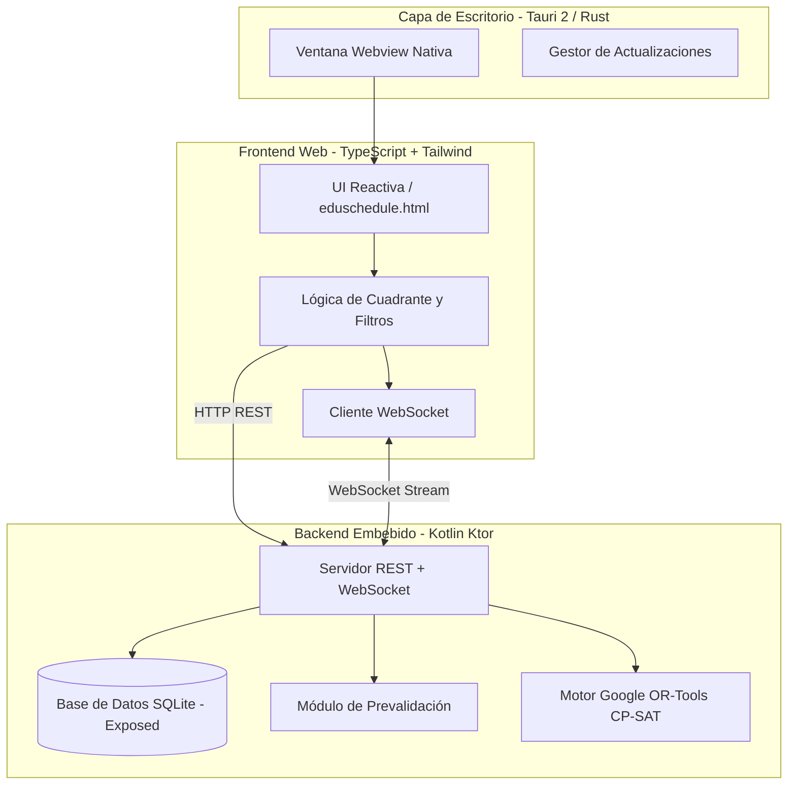

# 🎓 EduSchedule — Generador Inteligente de Horarios Escolares

<p align="center">
  
</p>

<p align="center">
  <strong>Software multiplataforma de optimización y generación automatizada de horarios para centros educativos.</strong>
</p>

<p align="center">
  
  
  
  
  
  
  
  
</p>

---

## 📖 ¿Qué es EduSchedule?

**EduSchedule** es una solución integral diseñada para resolver uno de los mayores dolores de cabeza en la gestión de colegios e institutos: **la confección del horario escolar**.

Combinando la potencia matemática de **Google OR-Tools (CP-SAT Solver)** con una arquitectura moderna de **Tauri 2 (Rust)**, **Kotlin Ktor** y **TypeScript**, EduSchedule es capaz de encontrar la distribución óptima de clases en cuestión de segundos, respetando todas las restricciones pedagógicas, de profesorado y de aulas.

---

## ✨ Características Principales

### 🧠 1. Motor de Optimización Matemática (CP-SAT)
* **Restricciones Duras (Garantizadas 100%)**:
  * Cero solapamientos de profesores y aulas.
  * Respeto absoluto a la disponibilidad horaria y reducciones de jornada del profesorado.
  * Cobertura exacta de las horas curriculares exigidas por cada asignatura y grupo.
* **Restricciones Suaves (Funciones de Puntuación)**:
  * Minimización de huecos (horas muertas) en la jornada del profesorado.
  * Distribución equilibrada y compacta de las jornadas lectivas.
  * Agrupación pedagógica de lecciones dobles/consecutivas cuando se requiere.

### ⚡ 2. Diagnóstico y Prevalidación Instantánea
* **Detección en milisegundos**: Analiza el cuadro docente antes de lanzar el solver y detecta incompatibilidades matemáticas (déficit de horas, sobrecarga de profesores, solapamientos imposibles).
* **Asistente con sugerencias**: Ofrece consejos exactos al usuario sobre cómo solucionar el conflicto.

### 📅 3. Cuadrante Interactivo con Bloqueo Manual (*Pinning*)
* Vista semanal por **Cursos/Grupos** y por **Profesor**.
* Capacidad de **fijar manualmente clases clave** (*Pinning*): el algoritmo respetará esas clases y optimizará el resto a su alrededor.
* Visualización en tiempo real del estado de cada celda y estadísticas de carga lectiva.

### 🔄 4. WebSocket en Tiempo Real
* Comunicación bidireccional continua con el motor: visualiza el progreso de optimización (*score*, límite teórico *bound* y número de soluciones encontradas) segundo a segundo.

### 📊 5. Importación y Exportación Excel
* Carga de datos docentes desde hojas de cálculo y exportación de horarios listos para imprimir o compartir.

### 🚀 6. Actualizaciones Automáticas
* Comprobador de versiones integrado con GitHub Releases: avisa de nuevas versiones y permite descargarlas con un solo clic.

---

## 🏗️ Arquitectura Técnica



---

## 📥 Descarga e Instalación

Puedes descargar la última versión desde la sección de **[Releases](https://github.com/guillemo12/Horarios-profesores/releases)**:

### 🪟 Windows
* **Ejecutable Portable (`EduSchedule_Unico.exe`)**: No requiere instalación, incluye todo el runtime empaquetado. Doble clic y listo.
* **Instalador Estándar (`.exe` NSIS)**: Asistente de instalación multilingüe con acceso directo en el escritorio.
* **Instalador MSI (`.msi`)**: Ideal para despliegues administrativos en red.

### 🐧 Linux
* **AppImage (`.AppImage`)**: Ejecutable portable universal para cualquier distribución Linux.
  ```bash
  chmod +x EduSchedule_*.AppImage
  ./EduSchedule_*.AppImage
  ```
* **Paquete Debian (`.deb`)**: Para distribuciones basadas en Debian/Ubuntu (`sudo dpkg -i eduschedule_*.deb`).

---

## 🛠️ Compilación y Desarrollo Local

### Requisitos Previos
* **Java JDK 21+**
* **Node.js 20+**
* **Rust & Cargo** (estable)
* **Tauri CLI**: `npm install -g @tauri-apps/cli`

### Pasos para Ejecutar en Modo Desarrollo

1. **Clonar el repositorio**:
   ```bash
   git clone https://github.com/guillemo12/Horarios-profesores.git
   cd Horarios-profesores
   ```

2. **Compilar el Frontend Web**:
   ```bash
   npx esbuild Web/src/Datos.ts --bundle --outfile=src/main/resources/static/Datos.js --format=iife
   cp Web/src/eduschedule.html src/main/resources/static/index.html
   ```

3. **Ejecutar el Servidor Backend (Kotlin)**:
   ```bash
   ./gradlew run
   ```
   > La aplicación web estará disponible en `http://localhost:8080`.

4. **Lanzar la App de Escritorio (Tauri)**:
   ```bash
   cd Proyecto_Horarios
   npm run tauri dev
   ```

### Ejecutar Pruebas
```bash
./gradlew test --info
```

---

## 📦 Pipeline de CI/CD (GitHub Actions)

El proyecto incluye un flujo de integración y despliegue continuo automatizado en [`.github/workflows/build-and-release.yml`](.github/workflows/build-and-release.yml):
* Compilación paralela en entornos limpios de **Windows** y **Linux**.
* Generación del Fat JAR y empaquetado de la JVM con `jpackage`.
* Sincronización automática de versión con el Git Tag (`v*`).
* Creación automática de la **GitHub Release** con todos los binarios listos para su descarga.

---

## 📄 Licencia

Este proyecto está desarrollado para la optimización y gestión de centros educativos. Consulta el archivo de licencia para más detalles.
