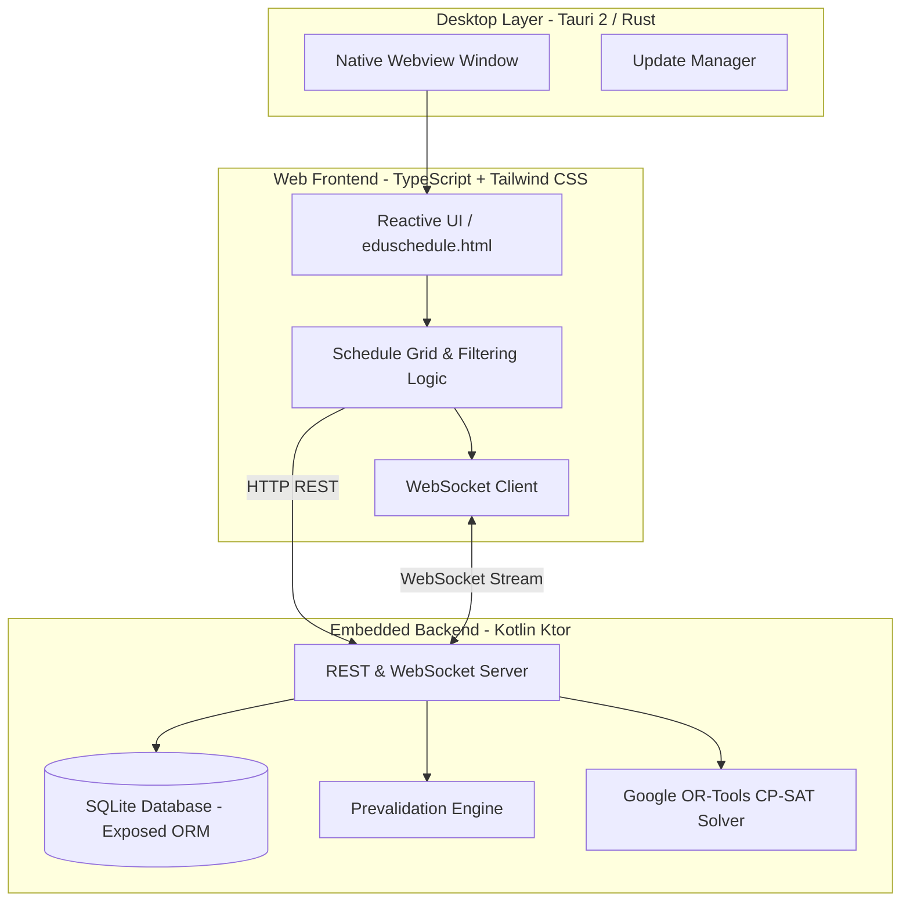

# 🎓 EduSchedule — Intelligent School Timetable Generator

<p align="center">
  
</p>

<p align="center">
  <strong>Cross-platform automated timetable generation and optimization software for educational institutions.</strong>
</p>

<p align="center">
  
  
  
  
  
  
  
  
</p>

---

## 📖 What is EduSchedule?

**EduSchedule** is a complete, modern solution designed to solve one of the most complex organizational challenges in schools, high schools, and universities: **generating optimal academic timetables**.

By combining the mathematical power of **Google OR-Tools (CP-SAT Solver)** with a high-performance **Tauri 2 (Rust)** desktop shell, an embedded **Kotlin Ktor** backend, and a reactive **TypeScript** frontend, EduSchedule finds optimal, conflict-free class schedules in seconds while strictly adhering to pedagogical constraints, teacher availability, and classroom limits.

---

## ✨ Key Features

### 🧠 1. Mathematical Optimization Engine (CP-SAT)
* **Hard Constraints (100% Guaranteed)**:
  * Zero overlaps for teachers and classrooms.
  * Strict compliance with teacher availability, time-off preferences, and reduced working hours.
  * Exact fulfillment of mandatory weekly curriculum hours per subject and group.
* **Soft Constraints (Cost & Penalty Minimization)**:
  * Minimization of idle periods / gaps between classes for teachers.
  * Balanced and compact daily workloads for both teachers and student cohorts.
  * Pedagogical grouping of double / consecutive lessons when required.

### ⚡ 2. Instant Prevalidation & Diagnostics
* **Sub-second Feasibility Analysis**: Pre-scans the academic setup prior to running the solver to detect mathematical impossibilities (such as teacher overload, hour deficits, or impossible manual locks).
* **Smart Recommendations**: Provides clear, actionable hints explaining exactly what is preventing a feasible schedule and how to resolve it.

### 📅 3. Interactive Schedule Grid with Manual Pinning
* Weekly views organized by **Course / Cohort** and by **Teacher**.
* **Manual Class Pinning**: Lock critical lessons to specific time slots—the solver will respect those fixed positions and optimize the rest of the schedule around them.
* Real-time workload statistics and cell status indicators.

### 🔄 4. Real-Time WebSockets
* Non-blocking, bi-directional streaming between the backend worker and the UI.
* Watch the solver converge live with real-time updates for best score, theoretical bound, and solution progression.

### 📊 5. Excel Import & Export
* Load school data from spreadsheets and export finalized timetables ready to share or print.

### 🚀 6. Built-in Automatic Updates
* Integrated update checker connected to GitHub Releases: alerts users when a new version is available and enables instant one-click downloads.

---

## 🏗️ Technical Architecture



---

## 📥 Download & Installation

Download the latest version from the **[GitHub Releases](https://github.com/guillemo12/Horarios-profesores/releases)** page:

### 🪟 Windows
* **Portable Executable (`EduSchedule_Unico.exe`)**: No installation required. Self-contained runtime—just download and run.
* **Standard Installer (`.exe` NSIS)**: Multilingual setup wizard with desktop shortcuts and uninstaller.
* **MSI Package (`.msi`)**: Ideal for IT administrators and network-wide GPO deployments.

### 🐧 Linux
* **AppImage (`.AppImage`)**: Universal standalone executable for any Linux distribution.
  ```bash
  chmod +x EduSchedule_*.AppImage
  ./EduSchedule_*.AppImage
  ```
* **Debian Package (`.deb`)**: For Debian/Ubuntu-based systems (`sudo dpkg -i eduschedule_*.deb`).

---

## 🛠️ Local Development & Building from Source

### Prerequisites
* **Java JDK 21+**
* **Node.js 20+**
* **Rust & Cargo** (stable toolchain)
* **Tauri CLI**: `npm install -g @tauri-apps/cli`

### Development Setup

1. **Clone the repository**:
   ```bash
   git clone https://github.com/guillemo12/Horarios-profesores.git
   cd Horarios-profesores
   ```

2. **Bundle the Web Frontend**:
   ```bash
   npx esbuild Web/src/Datos.ts --bundle --outfile=src/main/resources/static/Datos.js --format=iife
   cp Web/src/eduschedule.html src/main/resources/static/index.html
   ```

3. **Run the Backend Server (Kotlin)**:
   ```bash
   ./gradlew run
   ```
   > The web app will be available at `http://localhost:8080`.

4. **Launch the Desktop App (Tauri)**:
   ```bash
   cd Proyecto_Horarios
   npm run tauri dev
   ```

### Running Tests
```bash
./gradlew test --info
```

---

## 📦 CI/CD Pipeline (GitHub Actions)

EduSchedule features an automated continuous delivery pipeline configured in [`.github/workflows/build-and-release.yml`](.github/workflows/build-and-release.yml):
* Matrix builds on clean **Windows** and **Linux** runners.
* Fat JAR creation and JVM runtime packaging with `jpackage`.
* Automatic version synchronization with Git Tags (`v*`).
* Automated **GitHub Release** creation with all production installers and binaries attached.

---

## 📄 License

This project is developed for educational schedule optimization and management. See the license file for further details.
